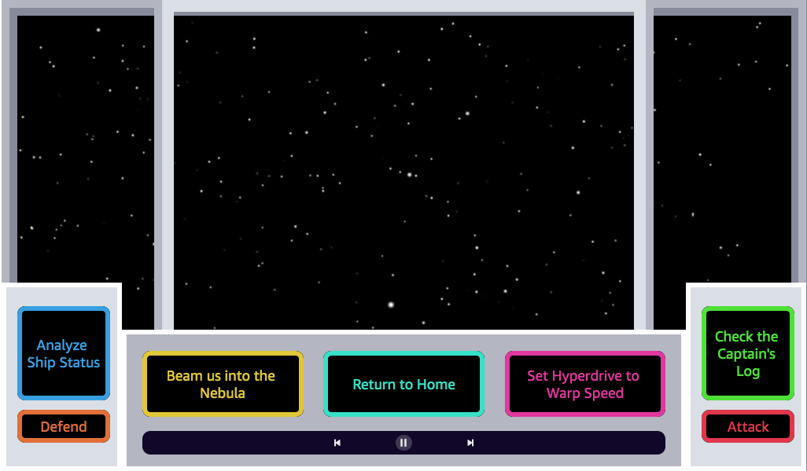
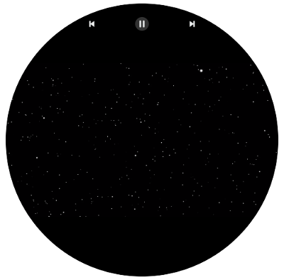

# Build your Displays with the Alexa Presentation Language 

The Alexa Presentation Language (APL) is Amazon’s new voice-first design language you can use to create rich, interactive displays for Alexa skills and tailor the experience for tens of millions of Alexa-enabled devices. Using APL, you can easily build customized, robust displays that coincide with your personal brand and the context of your voice experience.

In this workshop, you will enhance the customer's interaction with the Ship Commander skill by incorporating displays using APL. These displays will handle user interactions alongside voice.

## Objectives

After completing this workshop, you will be able to:

- Enable the APL interface within your skill
- Effectively utilize the APL Authoring Tool
- Create APL documents for your intents
- Send events from your display to your voice service
- Build APL documents according to various device mediums


## Prerequisites

This lab requires:

- Access to a notebook computer with Wi-Fi, running Microsoft Windows, Mac OSX, or Linux (Ubuntu, SuSE, or RedHat).
- An Internet browser such as Chrome, Firefox, or IE9 (previous versions of Internet Explorer are not supported).
- Having completed **[Step 0: Initialize Ship Commander](../Step-0-Initialize-your-Ship-Commander)**
- Having completed **[Step 1: Add SSML, Sound Effects, and Amazon Polly](../Step-1-Add-SSML-Sound-Effects-and-Amazon-Polly )**

## Goal: Create an enriching visual experience in your skill
Voice is the most natural form of interaction. But in a voice-first world, visuals can enhance interactions with Alexa-enabled devices. By combining visual elements with voice experiences, developers can expand the possibilities of what their skills can do. Alexa-enabled devices have varying display sizes and shapes, purposes, and hardware limitations. For example, while using a skill on an Echo Spot or Fire TV may have similar spoken interactions for a customer, interactivity and information rendered on the screen may vary drastically depending on the device features.

You will create a single display screen to accommodate each of your intents. The display screen will have elements variable according to each intent. 

### Task 2.1: Enable APL in your skill
First we need to assure that the APL interface is supported in our skill.

1. In the **Developer Portal** , select the **Build** tab in the top menu.
2. Click on the **Interfaces** tab on the left menu.
3. Scroll to the bottom and toggle **Alexa Presentation Language** to on. This will allow you to use APL in your skill.
4. Click on the **Save Interfaces** button at the top.
5. Once the interfaces are saved, click on **Build Model.**
6. Scroll down and select the **Display** tab on the left menu.
7. This will navigate you to the [**APL Authoring Tool**](https://developer.amazon.com/alexa/console/ask/displays?). This is an authoring tool used to create and edit APL documents for your skill. There are currently 7 sample templates you can use. For now, we will start from scratch. Select **Start from scratch**.

  - _Note:_ This is an authoring tool and NOT a simulator. To interact with and test your APL documents within the context of your skill, you need to add them to your skill and test in the testing console of the developer portal, or use the **Send to Device** feature in the authoring tool.

### Task 2.2: Construct the APL document for your intents

One of the benefits of using APL is that you can tailor your visual experience according to the device medium. According to the device, we need to consider the typical use case for a customer. A small, round, device like the Echo Spot, has less display to work with, versus a large landscape FireTV. So, for each APL document we create, we will have a _landscape_ and _round_ experience.



Fig. Example of a Landscape display using the Simulator



Fig. Example of a Round display using the Simulator


On the first display, we are showing a video that matches the experience they requested. On the landscape, we can see a full control panel of the ship that a customer can interact directly with.

First, let's build the display for a round device.

1. In the top pane, you can toggle between different devices. Select **Small Hub**.
2. Select the two **toggles** on the middle-right and top-right of the authoring tool. This should switch views to raw-code and side-by-side respectively. You should see this APL code in the editor:

```
{
    "type": "APL",
    "version": "1.0",
    "theme": "dark",
    "import": [],
    "resources": [],
    "styles": {},
    "layouts": {},
    "mainTemplate": {
        "items": []
    }
}
```
APL is made up of [components](https://developer.amazon.com/docs/alexa-presentation-language/apl-component.html) dictated in the mainTemplate. A component is a primitive element that displays on the viewport of the device.

3. Under items, **add** a **Container** component. This component can contain and orient child components.

```
{
    "type": "APL",
    "version": "1.0",
    "theme": "dark",
    "import": [],
    "resources": [],
    "styles": {},
    "layouts": {},
    "mainTemplate": {
        "items": [
            {
                "type": "Container",
                "width": "100vw",
                "height": "100vh",
                "items": []
            }
        ]
    }
}
```
This Container currently has a width 100% of the viewport width (100vw) and 100% of the viewport height (100vh).

4. Add a child component to the Container. **Insert** a [**video component**](https://developer.amazon.com/docs/alexa-presentation-language/apl-video.html) with the source attribute source set to [this video URL](https://ask-samples-resources.s3.amazonaws.com/workshop-starship-enterprise/videos/space.mp4).

```
{
    "type": "APL",
    "version": "1.0",
    "theme": "dark",
    "import": [],
    "resources": [],
    "styles": {},
    "layouts": {},
    "mainTemplate": {
        "items": [
            {
                "type": "Container",
                "width": "100vw",
                "height": "100vh",
                "items": [
                    {
                        "type": "Video",
                        "id": "myVideoPlayer",
                        "height": "100vh",
                        "width": "100vw",
                        "scale": "best-fill",
                        "autoplay": true,
                        "source": "https://ask-samples-resources.s3.amazonaws.com/workshop-starship-enterprise/videos/space.mp4",
                        "repeatCount": -1
                    }
                ]
            }
        ]
    }
}
```

Notice here that we set a `repeatCount` to -1. This means that the video will continue to repeat.

Finally, we want to incorporate transport controls to this video. These transport controls are required for certification. We will match the transport controls to the video component from the `id` we specified.

5. First, to get the built-in transport control component, we need to **import** [`alexa-layouts`](https://developer.amazon.com/docs/alexa-presentation-language/apl-layout.html).

```
{
    "type": "APL",
    "version": "1.0",
    "theme": "dark",
    "import": [
        {
          "name": "alexa-layouts",
          "version": "1.0.0"
        }
    ],
    "resources": [],
    "styles": {},
    "layouts": {},
    "mainTemplate": { ... }
}
```

6. Next, **add** the [`AlexaTransportControls`](https://developer.amazon.com/docs/alexa-presentation-language/apl-transport-controls-layout.html) layout under the video component

```
"mainTemplate": {
    "parameters": [
        "payload"
     ],
     "items": [
         {
             "type": "Container",
             "width": "100vw",
             "height": "100vh",
             "alignItems": "center",
             "items": [
                 {
                     "type": "Video",
                     "id": "myVideoPlayer",
                     "height": "100vh",
                     "width": "100vw",
                     "scale": "best-fill",
                     "autoplay": true,
                     "source": "https://ask-samples-resources.s3.amazonaws.com/workshop-starship-enterprise/videos/space.mp4",
                     "repeatCount": -1
                 },
                 {
                     "type": "AlexaTransportControls",
                     "mediaComponentId": "myVideoPlayer",
                     "primaryControlSize": "5vw",
                     "secondaryControlSize": "5vw",
                     "autoplay": "true",
                     "position": "absolute"
                 }
             ]
         }
     ]
 }
```

Now we have finished our display for the round hub. If we toggle between the different devices, we can see a similar experience across the mediums. Let's now add more to our GUI for our landscape devices.

First, we want to assure that we are only showing the current transport controls for round devices. This will be utilizing the built-in **viewport properties** that specifies device characteristics like size, shape, and orientation.

7. **Add** a `when` condition to the `AlexaTransportControls` component. The when statement uses data-binding to show or hide the component it is attached to based upon the condition specified. The condition should be _"if the viewport shape is round"_.

```
{
    "when": "${viewport.shape == 'round'}",
    "type": "AlexaTransportControls",
    "mediaComponentId": "myVideoPlayer",
    "primaryControlSize": "5vw",
    "secondaryControlSize": "5vw",
    "autoplay": "true",
    "position": "absolute"
}
```

Now if we toggle between devices, the transport controls are only visible for the round hub.

8. Toggle the device to the **Large Hub**.
9. **Insert** a `Container` component. On it, add a **when** statement. The condition should be _"if the viewport shape is NOT round"_.


```
"mainTemplate": {
    "parameters": [
        "payload"
     ],
     "items": [
         {
             "type": "Container",
             "width": "100vw",
             "height": "100vh",
             "alignItems": "center",
             "items": [
                 {
                     "type": "Video",
                     "id": "myVideoPlayer",
                     "height": "100vh",
                     "width": "100vw",
                     "scale": "best-fill",
                     "autoplay": true,
                     "source": "https://ask-samples-resources.s3.amazonaws.com/workshop-starship-enterprise/videos/space.mp4",
                     "repeatCount": -1
                 },
                 {
                     "when": "${viewport.shape == 'round'}",
                     "type": "AlexaTransportControls",
                     "mediaComponentId": "myVideoPlayer",
                     "primaryControlSize": "5vw",
                     "secondaryControlSize": "5vw",
                     "autoplay": "true",
                     "position": "absolute"
                 },
                 {
                     "when": "${viewport.shape != 'round'}",
                     "type": "Container",
                     "width": "100vw",
                     "height": "100vh",
                     "alignItems": "center",
                     "position": "absolute",
                     "items": []
                 }
             ]
         }
     ]
 }
```

Using APL, you are able to host your own custom [Layout](https://developer.amazon.com/docs/alexa-presentation-language/apl-layout.html), which are named composite components, to use throughout your skill.

We created various layouts for you to use within this skill to save time. You can see how these layouts are created by following this link to the [space-components.json](https://ask-samples-resources.s3.amazonaws.com/workshop-starship-enterprise/components/space-components.json). You will notice, that we have also hosted theme colors for our document. [Resources](https://developer.amazon.com/docs/alexa-presentation-language/apl-resources.html) are the global variables of APL documents dictated by the `@` symbol.

10. Scroll back up to imports and **import the hosted layouts**.

```
{
    "type": "APL",
    "version": "1.0",
    "theme": "dark",
    "import": [
        {
          "name": "alexa-layouts",
          "version": "1.0.0"
        },
        {
            "name": "space-components",
            "version": "1.0",
            "source": "https://ask-samples-resources.s3.amazonaws.com/workshop-starship-enterprise/components/space-components.json"
        }
    ],
    "resources": [],
    "styles": {},
    "layouts": {},
    "mainTemplate": { ... }
}
```

11. **Navigate** back to the Container we just added. 
12. **Add** the `Windows` layout and `ControlPanel` layout as children to the container. 

```
{
    "when": "${viewport.shape != 'round'}",
    "type": "Container",
    "width": "100vw",
    "height": "100vh",
    "alignItems": "center",
    "position": "absolute",
    "items": [
        {
            "type": "Windows"
        },
        {
            "type": "ControlPanel",
            "position": "absolute",
            "top": "60vh"
        }
    ]
}
```

These two layouts are made up of [**Frames**](https://developer.amazon.com/docs/alexa-presentation-language/apl-frame.html). The Frame can be of any shape, size and color. It supports solid and transparent colors (HEX or RGBA).

Now we have a display that resembles our Ship Commander center. 

### Task 2.2: Build Buttons into your Display

We have our Ship Commander center ready to insert buttons that allow the customer to interact further with the display. We want to have a touch input area for each custom intent.

There are three sections on the control panel for which we will place buttons. In our hosted layouts, we have previously built the buttons for us to use.

In creating a button, the most important component we use is a [TouchWrapper](https://developer.amazon.com/docs/alexa-presentation-language/apl-touchwrapper.html). The `TouchWrapper` appears similar to a `Component`, but it also can have the property `onPress` that can send an event or command to the skill code.

One of the commands you can send is called [SendEvent](https://developer.amazon.com/docs/alexa-presentation-language/apl-touchwrapper.html#sample-touchwrapper-for-individual-image). This will send a request to the service code that is interpreted as a `UserEvent`. Alongside this `UserEvent`, you can send arguments to distinguish what was pressed.

1. **Add** a `Container` to be placed atop the `ControlPanel`'s leftmost section.

```
{
    "type": "ControlPanel",
    "position": "absolute",
    "top": "60vh"
},
{
    "type": "Container",
    "width": "11.5vw",
    "height": "30vh",
    "position": "absolute",
    "top": "65vh",
    "left": "2vw",
    "items": []
}
```

We have various button types we can use. Each button layout has a _title_, _color_, and _arguments_ we are required to provide. The _title_ is the text that is shown on the button. The _color_ is the color of the border and font on the button. The _arguments_ are what is sent alongside the `UserEvent` when the customer taps on the button.

2. **Add** a `MediumButton` to the Container for the `AnalyzeShipStatusIntent`

```
{
    "type": "Container",
    "width": "11.5vw",
    "height": "30vh",
    "position": "absolute",
    "top": "65vh",
    "left": "2vw",
    "items": [
    	{
    	    "type": "MediumButton",
    	    "title": "Analyze Ship Status",
    	    "color": "@myBlue",
    	    "arguments": "analyze"
    	}
    ]
}
```

3. Next, **add** a `SmallButton` to the Container for the `DefendIntent`

```
{
    "type": "Container",
    "width": "11.5vw",
    "height": "30vh",
    "position": "absolute",
    "top": "65vh",
    "left": "2vw",
    "items": [
    	{
    	    "type": "MediumButton",
    	    "title": "Analyze Ship Status",
    	    "color": "@myBlue",
    	    "arguments": "analyze"
    	},
    	{
    	    "type": "SmallButton",
    	    "title": "Defend",
    	    "color": "@myOrange",
    	    "arguments": "defend",
    	    "position": "absolute",
    	    "top": "22vh"
    	}
    ]
}
```

Now we can see our buttons have appeared on the Control Panel layout. If a customer taps on one of these buttons, an APL `UserEvent` will be sent to the skill code along with the associated argument.

We can add now the rest of the buttons. We also need to assure that we are including transport controls for the landscape devices as well.

4. **Copy** the following code, and paste it after the Container we just created to create buttons for the center pane of the Control Panel layout: 

```
{
    "type": "Container",
    "width": "65vw",
    "height": "40vh",
    "position": "absolute",
    "top": "64vh",
    "alignItems": "center",
    "justifyContent": "center",
    "items": [
        {
            "type": "Container",
            "width": "65vw",
            "height": "20vh",
            "alignItems": "center",
            "justifyContent": "center",
            "direction": "row",
            "items": [
                {
                    "type": "LargeButton",
                    "title": "Beam us into the Nebula",
                    "color": "@myYellow",
                    "arguments": "beam",
                    "position": "absolute",
                    "left": "0vw"
                },
                {
                    "type": "LargeButton",
                    "title": "Return to Home",
                    "color": "@myTeal",
                    "arguments": "home"
                },
                {
                    "type": "LargeButton",
                    "title": "Set Hyperdrive to Warp Speed",
                    "color": "@myPink",
                    "arguments": "warp",
                    "position": "absolute",
                    "right": "0vw"
                }
            ]
        },
        {
            "type": "Frame",
            "width": "65vw",
            "height": "5vh",
            "backgroundColor": "@myNavy",
            "borderRadius": "1vw",
            "item": {
                "type": "Container",
                "width": "65vw",
                "height": "5vh",
                "alignItems": "center",
                "justifyContent": "center",
                "items": [
                    {
                        "type": "AlexaTransportControls",
                        "mediaComponentId": "myVideoPlayer",
                        "primaryControlSize": "2vw",
                        "secondaryControlSize": "2vw",
                        "autoplay": "true"
                    }
                ]
            }
        }
    ]
}
```
4. **Copy** the following code, and paste it after the Container we just created to create buttons for the right pane of the Control Panel layout: 

```
{
    "type": "Container",
    "width": "11.5vw",
    "height": "30vh",
    "position": "absolute",
    "top": "65vh",
    "left": "87vw",
    "items": [
        {
            "type": "MediumButton",
            "title": "Check the Captain's Log",
            "color": "@myGreen",
            "arguments": "checkLog"
        },
        {
            "type": "SmallButton",
            "title": "Attack",
            "color": "@myRed",
            "arguments": "attack",
            "position": "absolute",
            "top": "22vh"
        }
    ]
}
```

You should now be able to see the completed APL document in the visualizer! Notice how if you toggle to other devices, it adjusts and scaled accordingly.

### Task 2.3: Save the APL document with your skill code
We have finished authoring our display screen for our skill, we now need to add this APL code to our skill backend.

1. **Copy** the entire APL code we just generated.
2. **Navigate** back to the Developer Console by clicking on the logo in the upper left.
3. **Click** on your Ship Commander skill.
4. **Select** the **Code** tab in the top menu.
5. **Click** on the _Create File_ icon on the upper left.
6. Under **File Path:**, type _lambda/launch.json_
7. **Paste** your code into this file.
8. **Save** and **Deploy** your code.


### Congratulations! You have finished Task 2!

Continue the workshop with [**Step 3 - Pairing your VUI and GUI**](../Step-3-Pairing-your-VUI-and-GUI/)

Return to the [Workshop Main Page](../README.md)

