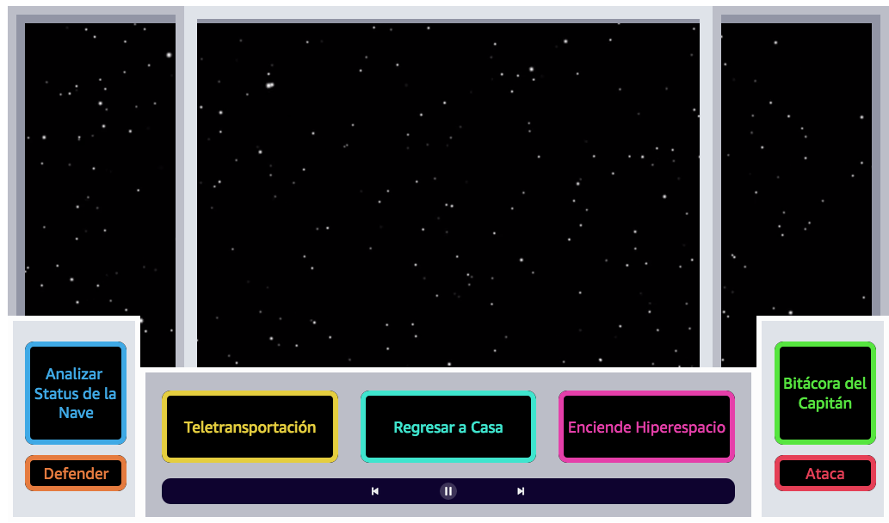
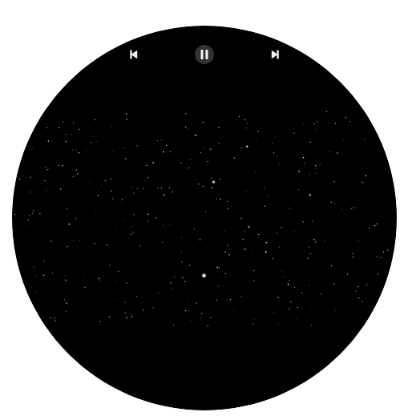

# Construye Tu Pantalla usando Alexa Presentation Language 

El Lenguaje de presentación de Alexa, por sus siglas en inglés, Alexa Presentation Language (APL) es el nuevo lenguaje de diseño de Amazon que puede usar para crear pantallas interactivas para las skills de Alexa y personalizar la experiencia para decenas de millones de dispositivos con Alexa. Con APL, puedes crear fácilmente pantallas personalizadas y robustas que coincidan con su marca personal y el contexto de su experiencia de voz.

En este taller, mejorará la interacción con el cliente de la skill Comando Espacial incorporando pantallas utilizando APL. Estas pantallas manejarán las interacciones del usuario junto con la voz.

## Objetivos

Después de completar este paso, tu podrás:

- Utilizar la herramienta de creación de APL
- Crear documento APL para tus intents
- Enviar eventos desde tu pantalla al servicio de voz de Alexa
- Construir documentos APL de acuerdo al dispositivo
- Añadir el código con las pantallas a tu skill


## Requisitos Previos

Este Lab requiere:

- Acceso a un equipo de computo con acceso a Wi-Fi, ejecutando Microsoft Windows, Mac OS X, o Linux (Ubuntu, SuSE, or RedHat).
- Un navegador de Internet como Chrome, Firefox o IE9 (Versiones anteriores no están soportadas)
- Haber completado el [Paso 0 - Inicializa el Comando Espacial de tu nave] (./Paso-0-Inicializa-Comando-Espacial/)
- Haber completao el [Paso 1 - Agregar SSML, Efectos de Sonido y Voces de Amazon Polly] (./Paso-1-Agrega-SSML-Efectos-De-Sonido-Y-Amazon-Polly/)

## Objetivo: Creare una experiencia visual para tu skill

La voz es la forma más natural de interacción y siempre debemos enforcarnos en que la experiencia de Voz sea única, sin embargo, cuando es posible, los elementos visuales pueden mejorar las interacciones con el servicios de voz de Alexa. Al combinar elementos visuales con experiencias de voz, los desarrolladores pueden ampliar las posibilidades de lo que pueden hacer sus skills. 


Los dispositivos con Alexa tienen diferentes tamaños y formas de visualización, propósitos y limitaciones de hardware. Por ejemplo, mientras que usar una habilidad en un Echo Spot o Fire TV puede tener interacciones habladas similares para un cliente, la interacción y la información que se muestra en la pantalla pueden variar drásticamente según las características del dispositivo.

En este paso, crearás una pantalla de visualización flexible para adaptarla a cada uno de sus intents. La pantalla de visualización tendrá elementos variables según cada intent.

### Actividad 2.1: Habilitar tu Skill para que soporte APL

Primero te tienes que asegurar que la interfaz APL está soportada en tu skill.

1. En el **Developer Portal** , selecciona el tab de **Build** en el menú de arriba.
2. Haz click en  **Interfaces** en el manu de la izquierda.
3. Mueve el cursos hacia abajo y haz para encender el interruptor que dice **Alexa Presentation Language**. Esto te permitirá usar APL en tu skill.
4. Haz click en el botón **Save Interfaces** en la parte de arriba.
5. Una vez que las interfaces estén guardadas, haz click en **Build Model** para guardar tu modelo.
6. Mueve el cursos hacia abajo y haz click en el botón **Display** en el menú de la izquierda.
7. Esto abrirá un nuevo tab del navegador con la herramienta de creación de APL llamada: [**APL Authoring Tool**](https://developer.amazon.com/alexa/console/ask/displays?). Esta es una herramienta de creación y edición de pantallas con APL. Existen varias plantillas que puedes usar, para este caso lo haremos desde cero, por lo tanto haz click en **Start from scratch**.

  - _Nota:_ Esta es una herramienta de creación y no es un simulador. Para interactuar y probar tu skill con APL necesitaremos agregar las pantallas que creamos al código en tu skill y podrás verlas en el tab de test. Si cuentas con un dispositivo usando la misma cuenta, también podrás ver como se ve la pantalla que estas construyendo en el dispositivo haciendo click en **Send to Device** en la parte superior derecha. Para este paso solo crearás las pantallas y en el siguiente las integrarás con tu skill.


### Actividad 2.2: Construye el documento APL para tus intents

Uno de los beneficios de usar APL es que puedes personalizar tu experiencia visual de acuerdo al tipo o medio de dispositivo. Con base en el dispositivo que envía la petición, tienes que adecuar la respuesta en APL, por ejemplo para un Echo Spot tienes que enviar una respuesta circular mas pequeña, comparado con un dispositivo rectangular como el Echo Show. Entonces, para cada document que creamos, tendremos una experiencia _landscape_ o _round_ 




Fig. Ejemplo de pantalla en landscape.



Fig. ejemplo de pantalla circulas


En la primer pantalla, estamos mostrando un video que simula la experiencia de estar en el espacio, para la experiencia rectangular podemos agregar un panel de la nave con el que el usuario puede interactuar tocando la pantalla y enviando eventos.

Primero, construiremos el dispositivo circular.

1. Selecciona la opción **Start from Scratch** 
2. En el pane de arriba, es posible cambiar el tipo de dispositivo, selecciona **Small Hub**, botón que muestra un dispositivo circular y de pronto la herramienta de creación muestra una pantalla circular.
3. Selecciona el interruptor que está en medio. Esto cambiará la pantalla y se mostrará un código en json igual al que se muestra a continuación

```
{
    "type": "APL",
    "version": "1.0",
    "theme": "dark",
    "import": [],
    "resources": [],
    "styles": {},
    "layouts": {},
    "mainTemplate": {
        "items": []
    }
}
```
APL está hecho de [componentes](https://developer.amazon.com/docs/alexa-presentation-language/apl-component.html) que se describen en el template principal (mainTemplate). Un componente es un elemento primitivo que se muestra en la pantalla (viewport) de un dispositivo.

4. Dentro de la sección **items** agregar un **Container**. Este componente "Contenedor" puede contener otros componentes y envuelve los **items** para que puedas modificar la manera como se ordernan y muestran.

```
{
    "type": "APL",
    "version": "1.0",
    "theme": "dark",
    "import": [],
    "resources": [],
    "styles": {},
    "layouts": {},
    "mainTemplate": {
        "items": [
            {
                "type": "Container",
                "width": "100vw",
                "height": "100vh",
                "items": []
            }
        ]
    }
}
```
Este container tiene un ancho del 100% del ancho del viewport o pantalla y un alto de 100% del alto del view port o pantalla.

5. Agregar un componente al contenedor. Dentro del "Container" que acabas de crear, ahora **agrega** un componente de [**video component**](https://developer.amazon.com/docs/alexa-presentation-language/apl-video.html) con el atributo **source** o fuente asignado a: [esta URL de Video](https://ask-samples-resources.s3.amazonaws.com/workshop-starship-enterprise/videos/space.mp4).

```
{
    "type": "APL",
    "version": "1.0",
    "theme": "dark",
    "import": [],
    "resources": [],
    "styles": {},
    "layouts": {},
    "mainTemplate": {
        "items": [
            {
                "type": "Container",
                "width": "100vw",
                "height": "100vh",
                "items": [
                    {
                        "type": "Video",
                        "id": "myVideoPlayer",
                        "height": "100vh",
                        "width": "100vw",
                        "scale": "best-fill",
                        "autoplay": true,
                        "source": "https://ask-samples-resources.s3.amazonaws.com/workshop-starship-enterprise/videos/space.mp4",
                        "repeatCount": -1
                    }
                ]
            }
        ]
    }
}
```

Nota como establecimiento el valor del atributo `repeatCount` a -1. Esto significa que el video se repetirá de forma infinita.

Finalmente, tienes que agregar los controles de video que son necesarios para la certificación de una skill. Para agregar los controles a un'id' que especificaste. 

6. Primero para utilizar el componente built-in que muestra los controles de transporte es necesario **import** [`alexa-layouts`](https://developer.amazon.com/docs/alexa-presentation-language/apl-layout.html), esto lo consigues agregando alexa-layous al atributo import de tu archivo JSON como se muestra acontinuación:

```
{
    "type": "APL",
    "version": "1.0",
    "theme": "dark",
    "import": [
        {
          "name": "alexa-layouts",
          "version": "1.0.0"
        }
    ],
    "resources": [],
    "styles": {},
    "layouts": {},
    "mainTemplate": { ... }
}
```

7. Después, **agregas** el componentes [`AlexaTransportControls`](https://developer.amazon.com/docs/alexa-presentation-language/apl-transport-controls-layout.html) como un nuevo item, debajo del componente de video:

```
{
    "type": "APL",
    "version": "1.0",
    "theme": "dark",
    "import": [
        {
          "name": "alexa-layouts",
          "version": "1.0.0"
        }
    ],
    "resources": [],
    "styles": {},
    "layouts": {},
    "mainTemplate":{
    "parameters": [
        "payload"
     ],
     "items": [
         {
             "type": "Container",
             "width": "100vw",
             "height": "100vh",
             "alignItems": "center",
             "items": [
                 {
                     "type": "Video",
                     "id": "myVideoPlayer",
                     "height": "100vh",
                     "width": "100vw",
                     "scale": "best-fill",
                     "autoplay": true,
                     "source": "https://ask-samples-resources.s3.amazonaws.com/workshop-starship-enterprise/videos/space.mp4",
                     "repeatCount": -1
                 },
                 {
                     "type": "AlexaTransportControls",
                     "mediaComponentId": "myVideoPlayer",
                     "primaryControlSize": "5vw",
                     "secondaryControlSize": "5vw",
                     "autoplay": "true",
                     "position": "absolute"
                 }
             ]
         }
     ]
    }
}
```

Ahora que has terminado tus pantallas para dispositivos redondos, si intercambias entre los diferentes dispositivos vemos experiencias similares entre todos los medios o viewports. Ahora agregaremos mas a nuestra GUI para dispositivos rectangulares.

Primero te debes de asegurar que solo estamos mostrando los controles de video cuando la pantalla del dispositivo es redonda, para lograr esto utilizaremos las **propiedades de viewport** donde se especifica las características del dispositivos como tamaño, forma y orientación.


8. **Agrega** una condición `when` al componente `AlexaTransportControls`. La condicional when utiliza los datos del dispositivo para mostrar u ocultar el componente con base en la condición que has escrito. En este caso la condición es _si viewport.shape es igual **round**_" entonces muestra ese componente.

```
{
    "when": "${viewport.shape == 'round'}",
    "type": "AlexaTransportControls",
    "mediaComponentId": "myVideoPlayer",
    "primaryControlSize": "5vw",
    "secondaryControlSize": "5vw",
    "autoplay": "true",
    "position": "absolute"
}
```

Ahora si cambias el tipo de dispositivo en la parte superior, los controles de video solo están disponibles para la pantalla redonda.

9. Cambia la pantalla por una rectangular **Small Hub**.
10. Ahora **inserta** un componente `Container`, y agregar la condicional **when**.  En este caso la condición es _si viewport.shape **NO** es igual **round**_" entonces muestra ese componente.

```
"mainTemplate": {
    "parameters": [
        "payload"
     ],
     "items": [
         {
             "type": "Container",
             "width": "100vw",
             "height": "100vh",
             "alignItems": "center",
             "items": [
                 {
                     "type": "Video",
                     "id": "myVideoPlayer",
                     "height": "100vh",
                     "width": "100vw",
                     "scale": "best-fill",
                     "autoplay": true,
                     "source": "https://ask-samples-resources.s3.amazonaws.com/workshop-starship-enterprise/videos/space.mp4",
                     "repeatCount": -1
                 },
                 {
                     "when": "${viewport.shape == 'round'}",
                     "type": "AlexaTransportControls",
                     "mediaComponentId": "myVideoPlayer",
                     "primaryControlSize": "5vw",
                     "secondaryControlSize": "5vw",
                     "autoplay": "true",
                     "position": "absolute"
                 },
                 {
                     "when": "${viewport.shape != 'round'}",
                     "type": "Container",
                     "width": "100vw",
                     "height": "100vh",
                     "alignItems": "center",
                     "position": "absolute",
                     "items": []
                 }
             ]
         }
     ]
 }
```

Usando APL, tu puedes hospedar tus propios [Layout](https://developer.amazon.com/docs/alexa-presentation-language/apl-layout.html) personalizados o también llamados: Composite Components para utilizarlos en tus skills.

Ya hemos creado los layouts para que lo uses en este skill y ahorremos tiempo. Puedes revisar los layouts que hemos creado en: [space-components.json](https://ask-samples-resources.s3.amazonaws.com/workshop-starship-enterprise/components/space-components.json). Como podrás darte cuenta, también hemos agregado colores [Resources](https://developer.amazon.com/docs/alexa-presentation-language/apl-resources.html) que son variables globales definidas por el símbolo de `@`.

11. Mueve el cursos hasta el atributo de imports y agrega el archivo donde tenemos nuestro **hosted layouts**.

```
{
    "type": "APL",
    "version": "1.0",
    "theme": "dark",
    "import": [
        {
          "name": "alexa-layouts",
          "version": "1.0.0"
        },
        {
            "name": "space-components",
            "version": "1.0",
            "source": "https://ask-samples-resources.s3.amazonaws.com/workshop-starship-enterprise/components/space-components.json"
        }
    ],
    "resources": [],
    "styles": {},
    "layouts": {},
    "mainTemplate": { ... }
}
```

11. **Navega** de regreso al container que agregamos con la condicional `"when": "${viewport.shape != 'round'}"` y **agrega** los layouts de `Windows` y el layout de `ControlPanel` como items en ese container.

```
{
    "when": "${viewport.shape != 'round'}",
    "type": "Container",
    "width": "100vw",
    "height": "100vh",
    "alignItems": "center",
    "position": "absolute",
    "items": [
        {
            "type": "Windows"
        },
        {
            "type": "ControlPanel",
            "position": "absolute",
            "top": "60vh"
        }
    ]
}
```

Estos layouts están hechos de [**Frames**](https://developer.amazon.com/docs/alexa-presentation-language/apl-frame.html). 
Un Frame puede tener cualquier forma, tamaño y color, soporta colores sólidos y transparentes (HEW o RGBA)

Ahora tenemos una pantalla que simula la cabina de nuestra nave espacial.

### Actividad 2.2: Construir los botones en nuestra pantalla

Ya has construido la cabina lista para comenzar a agregar botones para que los usuarios puedan interactuar con la pantalla, necesitas agregar una área de entrada de inputs touch para cada intent.

Hay tres secciones en el panel de control donde vas a agregar los botones. En el layout que has importado hemos creado esos botones para usarlos.

Cuando creas un botón, el componente mas importante para usar es:[TouchWrapper](https://developer.amazon.com/docs/alexa-presentation-language/apl-touchwrapper.html). El `TouchWrapper` se muestra similar a un `Component`, pero tiene la propiedad de `onPress` donde puedes enviar eventos o comandos a tu skill.

Uno de los comandos que puede enviar se llama: [SendEvent](https://developer.amazon.com/docs/alexa-presentation-language/apl-touchwrapper.html#sample-touchwrapper-for-individual-image). Esto enviará una petición al código de tu servicio y será interpretado como un `UserEvent`. Junto con este `UserEvent`, tu puedes enviar argumentos para distinguir que es lo que fue presionado.

1. **Agrega** un `Container` a la parte superior izquierda del `ControlPanel`.

```
{
    "type": "ControlPanel",
    "position": "absolute",
    "top": "60vh"
},
{
    "type": "Container",
    "width": "11.5vw",
    "height": "30vh",
    "position": "absolute",
    "top": "65vh",
    "left": "2vw",
    "items": []
}
```

Hay varios tipos de botones que puedes usar. Cada **layout** tiene los siguientes atributos requeridos: _title_, _color_, and _arguments_, Título, Coloy y argumentos respectivametne. El _title_ es el título o texto que se muestra en el botón. El _color_ es el color del borde y el texto del botón. Los _arguments_ son los argumentos o parámetros que serán enviados como parte del evento `UserEvent` para poder identificar qué acción ocurrió.


2. **Agrega** un `MediumButton` con el título: "Analizar Status de la Nave" al mismo contenedor para el intent: `AnalyzeShipStatusIntent`

```
{
    "type": "Container",
    "width": "11.5vw",
    "height": "30vh",
    "position": "absolute",
    "top": "65vh",
    "left": "2vw",
    "items": [
    	{
    	    "type": "MediumButton",
    	    "title": "Analizar Status de la Nave",
    	    "color": "@myBlue",
    	    "arguments": "analyze"
    	}
    ]
}
```

3. En seguida, **agrega** un `SmallButton` al mismo contenedor con el título: "Defender" para el `DefendIntent`

```
{
    "type": "Container",
    "width": "11.5vw",
    "height": "30vh",
    "position": "absolute",
    "top": "65vh",
    "left": "2vw",
    "items": [
    	{
    	    "type": "MediumButton",
    	    "title": "Analyze Ship Status",
    	    "color": "@myBlue",
    	    "arguments": "analyze"
    	},
    	{
    	    "type": "SmallButton",
    	    "title": "Defender",
    	    "color": "@myOrange",
    	    "arguments": "defend",
    	    "position": "absolute",
    	    "top": "22vh"
    	}
    ]
}
```

Ahora puedes ver como aparecen los botones en la pantalla. Si un usuario toca uno de estos botones, un evento de tipo `UserEvent` será enviado al código de la skill con el argumento asociado.

Ahora podemos agregar el resto de los botones. Asegúrate de incluir los botones de video para los dispositivos de pantalla rectangular.ell.

4. **Copia** el siguiente código, y pégalo justo despues del contenedor que acabamos de crear, esto creará los botones para el panel central de nuestro control de la nave.

```
{
    "type": "Container",
    "width": "65vw",
    "height": "40vh",
    "position": "absolute",
    "top": "64vh",
    "alignItems": "center",
    "justifyContent": "center",
    "items": [
        {
            "type": "Container",
            "width": "65vw",
            "height": "20vh",
            "alignItems": "center",
            "justifyContent": "center",
            "direction": "row",
            "items": [
                {
                    "type": "LargeButton",
                    "title": "Teletransportación",
                    "color": "@myYellow",
                    "arguments": "beam",
                    "position": "absolute",
                    "left": "0vw"
                },
                {
                    "type": "LargeButton",
                    "title": "Regresar a Casa",
                    "color": "@myTeal",
                    "arguments": "home"
                },
                {
                    "type": "LargeButton",
                    "title": "Enciende Hiperespacio",
                    "color": "@myPink",
                    "arguments": "warp",
                    "position": "absolute",
                    "right": "0vw"
                }
            ]
        },
        {
            "type": "Frame",
            "width": "65vw",
            "height": "5vh",
            "backgroundColor": "@myNavy",
            "borderRadius": "1vw",
            "item": {
                "type": "Container",
                "width": "65vw",
                "height": "5vh",
                "alignItems": "center",
                "justifyContent": "center",
                "items": [
                    {
                        "type": "AlexaTransportControls",
                        "mediaComponentId": "myVideoPlayer",
                        "primaryControlSize": "2vw",
                        "secondaryControlSize": "2vw",
                        "autoplay": "true"
                    }
                ]
            }
        }
    ]
}
```
4. Ahora tienes que crear los botones para el panel de la derecha. **Copia** el siguiente código y pégalo después del contenedor que acabas de crear.


```
{
    "type": "Container",
    "width": "11.5vw",
    "height": "30vh",
    "position": "absolute",
    "top": "65vh",
    "left": "87vw",
    "items": [
        {
            "type": "MediumButton",
            "title": "Bitácora del Capitán",
            "color": "@myGreen",
            "arguments": "checkLog"
        },
        {
            "type": "SmallButton",
            "title": "Ataca",
            "color": "@myRed",
            "arguments": "attack",
            "position": "absolute",
            "top": "22vh"
        }
    ]
}
```

Ahora puedes visualizar la cabina completa de la nave. Cambia a los demás dispositivos y revisa como se ajusta a las dimensiones de cada uno.

### Actividad 2.3: Guarda el Documento APL con el código de tu skill. 

Has terminado de crear las pantallas para tu skill, ahora solo necesitas agregar este código a tu skill.


1. **Copy** en documento entero que has construido.
2. **Navega** a la consola de desarrollo haciendo click en el logo de Alexa en la parte superior izquierda.
3. Haz **click** en la skill "Comando Espacial".
4. **Selecciona** el tab de **code**.
5. Haz **click** en el icono _Create File_ en la parte superios izquierda.
6. En el diálogo que aparece **File Path:**, escribe _lambda/launch.json_
7. **Pega** todo el código en este archivo.
8. Haz click en **Save** y **Deploy** para guardar y desplegar tu código respectivamente..


### ¡Felicitaciones! Has terminado el paso 2.

Ahora continúa el taller con el siguiente [**Paso 2 - Construye tu pantalla**](../Paso-2-Construye-Tu-Pantalla/)

Regresa a la [Página Principal](../README.md)
